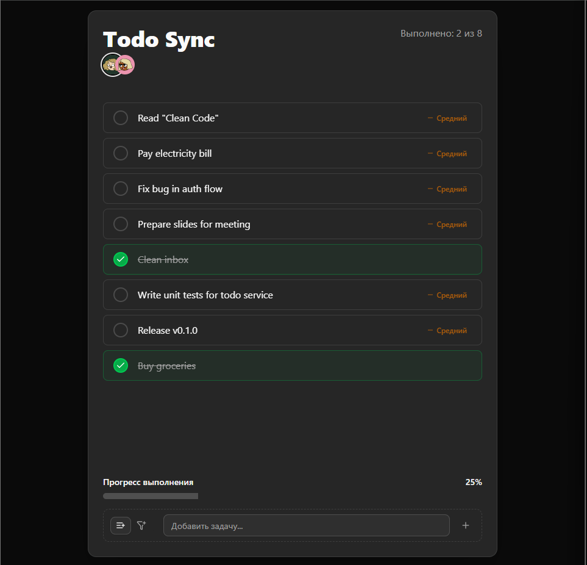

# Todo Template

## Особенности

- **Socket.IO** — двусторонняя синхронизация задач между клиентами в реальном времени.
- **Express.js** — простой REST API + WebSocket сервер.
- **Монорепозиторий** — фронтенд и бэкенд в одном репо через Yarn Workspaces.
- **Vite** — быстрая сборка и HMR для фронтенда.
- **Winston** — логирование на сервере.

<!-- Badges -->
<div align="center">
  
  
  
  
  <br/>
  
  
  
  
</div>

## Демонстрация



## Установка

```bash
# Клонирование репозитория
git clone https://github.com/printWhoIsHere/TodoOverflow.git
cd TodoOverflow/projects/todo-template

# Установка зависимостей
yarn install

# Запуск dev-сервера (front и back одновременно)
yarn dev

```

## Настройка `.env`

Для корректной работы проекта необходимо создать файл .env в корне frontend и backend (на примере .env.example):

### Backend

```bash
# env

PORT=3000
HOST=0.0.0.0
```

### Frontend

```bash
# env

VITE_API_BASE_URL=/api
# Прямое подключение к backend по LAN
VITE_SOCKET_ENDPOINT=http://<LAN_IP>:5173

# Через Vite proxy
VITE_SOCKET_ENDPOINT=/socket.io
```
