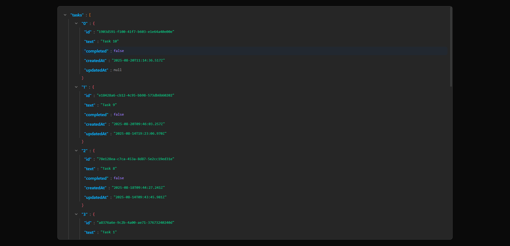

# Todo Template

---

## Особенности

- **Feature-Sliced Design** - логическое разделение по слоям и фичам, удобство масштабирования.
- **React Query** - кеширование и удобная логика загрузки данных.
- **JSON Viewer** - компонент для красивого отображения объектов/ответов API.
- **MSW Mocking** - моки для локальной разработки и интеграционных тестов.
- **OpenAPI Schema** - спецификация для типов и контрактов API; генерация типов через openapi-typescript.
- **Модульная архитектура** - легко добавлять новые фичи и переиспользовать код.

<!-- Badges -->
<div align="center">
  
  
  
  
  </br>

  
  
  
</div>

## Демонстрация



## Установка

```bash
# Клонирование репозитория
git clone https://github.com/printWhoIsHere/TodoOverflow.git
cd TodoOverflow/projects/todo-template

# Установка зависимостей
yarn install

# Запуск dev-сервера (Vite)
yarn dev
```

## Доступные команды

```bash
yarn dev   # Запуск Vite в режиме разработки
yarn api   # Генерация типов OpenAPI (npx openapi-typescript ...)
```
